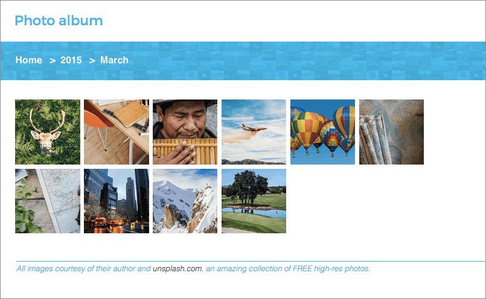

# thumbsup

<!-- Project info -->
[](https://npmjs.org/package/thumbsup)
[](https://github.com/thumbsup/thumbsup)
[](http://standardjs.com/)

<!-- Build status and code analysis -->
[](https://travis-ci.org/thumbsup/thumbsup)
[](https://hub.docker.com/r/thumbsupgallery/thumbsup)
[](https://david-dm.org/thumbsup/thumbsup)
[](https://david-dm.org/thumbsup/thumbsup?type=dev)

<!-- Social sharing -->
[](https://twitter.com/intent/tweet?text=Need%20static%20photo%20and%20video%20galleries?%20Check%20out%20Thumbsup%20on%20Github&url=https://github.com/thumbsup/thumbsup&hashtags=selfhosted,static,gallery)
[](https://www.linkedin.com/shareArticle?mini=true&url=https://github.com/thumbsup/thumbsup&title=Static%20gallery%20generator&summary=Thumbsup%20is%20a%20command-line%20friendly%20static%20gallery%20generator%20for%20all%20your%20photos%20and%20videos&source=Github)
[](https://www.facebook.com/sharer.php?u=https://github.com/thumbsup/thumbsup)

---

<p align="center">https://thumbsup.github.io</p>


---

Turn any folder with photos &amp; videos into a web gallery.

- thumbnails & multiple resolutions for fast previews
- mobile friendly website with customisable themes
- only rebuilds changed files: it's fast!
- uses relative paths so you can deploy the pages anywhere
- works great with Amazon S3 for static hosting

## Quick start

Simply point `thumbsup` to a folder with photos &amp; videos. All nested folders become separate albums.

```bash
npm install -g thumbsup
thumbsup --input ./photos --output ./gallery
```


There are many command line arguments to customise the output.
See the website for the full documentation: https://thumbsup.github.io.

## Requirements

Thumbsup requires the following dependencies:
- [Node.js](http://nodejs.org/): `brew install node`
- [exiftool](http://www.sno.phy.queensu.ca/~phil/exiftool/): `brew install exiftool`
- [GraphicsMagick](http://www.graphicsmagick.org/): `brew install graphicsmagick`

And optionally:
- [FFmpeg](http://www.ffmpeg.org/) to process videos: `brew install ffmpeg`
- [Gifsicle](http://www.lcdf.org/gifsicle/) to process animated GIFs: `brew install gifsicle`
- [dcraw](https://www.cybercom.net/~dcoffin/dcraw/) to process RAW photos: `brew install dcraw`

You can run thumbsup as a Docker container ([thumbsupgallery/thumbsup](https://hub.docker.com/r/thumbsupgallery/thumbsup/)) which pre-packages all the dependencies above. Read the [thumbsup on Docker](https://thumbsup.github.io/docs/2-installation/docker/) documentation for more detail.

```bash
docker run -v `pwd`:/work thumbsupgallery/thumbsup [...]
```

## Sample gallery

See a sample gallery online at https://thumbsup.github.io/demos/themes/mosaic/



## Command line arguments

This reflects the CLI for the latest code on `master`.
For the latest published version please refer to the [docs on the website](https://thumbsup.github.io).

<!-- START cli -->
```


 Usages:
   thumbsup [required] [options]
   thumbsup --config config.json


Required:
  --input   Path to the folder with all photos/videos  [string] [required]
  --output  Output path for the static website  [string] [required]

Input options:
  --include-photos      Include photos in the gallery  [boolean] [default: true]
  --include-videos      Include videos in the gallery  [boolean] [default: true]
  --include-raw-photos  Include raw photos in the gallery  [boolean] [default: false]
  --include             Glob pattern of files to include  [array]
  --exclude             Glob pattern of files to exclude  [array]

Output options:
  --thumb-size          Pixel size of the square thumbnails  [number] [default: 120]
  --large-size          Pixel height of the fullscreen photos  [number] [default: 1000]
  --photo-quality       Quality of the resized/converted photos  [number] [default: 90]
  --video-quality       Quality of the converted video (percent)  [number] [default: 75]
  --video-bitrate       Bitrate of the converted videos (e.g. 120k)  [string] [default: null]
  --video-format        Video output format  [choices: "mp4", "webm"] [default: "mp4"]
  --photo-preview       How lightbox photos are generated  [choices: "resize", "copy", "symlink", "link"] [default: "resize"]
  --video-preview       How lightbox videos are generated  [choices: "resize", "copy", "symlink", "link"] [default: "resize"]
  --photo-download      How downloadable photos are generated  [choices: "resize", "copy", "symlink", "link"] [default: "resize"]
  --video-download      How downloadable videos are generated  [choices: "resize", "copy", "symlink", "link"] [default: "resize"]
  --link-prefix         Path or URL prefix for "linked" photos and videos  [string]
  --cleanup             Remove any output file that's no longer needed  [boolean] [default: false]
  --concurrency         Number of parallel parsing/processing operations  [number] [default: 4]
  --output-structure    File and folder structure for output media  [choices: "folders", "suffix"] [default: "folders"]
  --gm-args             Custom image processing arguments for GraphicsMagick  [array]
  --watermark           Path to a transparent PNG to be overlaid on all images  [string]
  --watermark-position  Position of the watermark  [choices: "Repeat", "Center", "NorthWest", "North", "NorthEast", "West", "East", "SouthWest", "South", "SouthEast"]

Album options:
  --albums-from            How files are grouped into albums  [array] [default: ["%path"]]
  --sort-albums-by         How to sort albums  [choices: "title", "start-date", "end-date"] [default: "start-date"]
  --sort-albums-direction  Album sorting direction  [choices: "asc", "desc"] [default: "asc"]
  --sort-media-by          How to sort photos and videos  [choices: "filename", "date"] [default: "date"]
  --sort-media-direction   Media sorting direction  [choices: "asc", "desc"] [default: "asc"]

Website options:
  --index                 Filename of the home page  [default: "index.html"]
  --albums-output-folder  Output subfolder for HTML albums (default: website root)  [default: "."]
  --theme                 Name of a built-in gallery theme  [choices: "classic", "cards", "mosaic"] [default: "classic"]
  --theme-path            Path to a custom theme  [string]
  --theme-style           Path to a custom LESS/CSS file for additional styles  [string]
  --title                 Website title  [default: "Photo album"]
  --footer                Text or HTML footer  [default: null]
  --google-analytics      Code for Google Analytics tracking  [string]
  --embed-exif            Embed the exif metadata for each image into the gallery page  [boolean] [default: false]

Misc options:
  --config       JSON config file (one key per argument)  [string]
  --log          Print a detailed text log  [choices: null, "info", "debug", "trace"] [default: null]
  --usage-stats  Enable anonymous usage statistics  [boolean] [default: true]
  --dry-run      Update the index, but don't create the media files / website  [boolean] [default: false]

Deprecated:
  --original-photos       Copy and allow download of full-size photos  [boolean]
  --original-videos       Copy and allow download of full-size videos  [boolean]
  --albums-date-format    How albums are named in <date> mode [moment.js pattern]
  --css                   Path to a custom provided CSS/LESS file for styling  [string]
  --download-photos       Target of the photo download links  [choices: "large", "copy", "symlink", "link"]
  --download-videos       Target of the video download links  [choices: "large", "copy", "symlink", "link"]
  --download-link-prefix  Path or URL prefix for linked downloads  [string]

Options:
  --version  Show version number  [boolean]
  --help     Show help  [boolean]


 The optional JSON config should contain a single object with one key
 per argument, not including the leading "--". For example:
 { "sort-albums-by": "start-date" }
```

<!-- END cli -->

## Contributing

We welcome all [issues](https://github.com/thumbsup/thumbsup/issues)
and [pull requests](https://github.com/thumbsup/thumbsup/pulls)!

If you are facing any issues or getting crashes, please try the following options to help troubleshoot:

```bash
thumbsup [options] --log debug
# [16:04:56] media/thumbs/photo-1446822622709-e1c7ad6e82d52.jpg [started]
# [16:04:57] media/thumbs/photo-1446822622709-e1c7ad6e82d52.jpg [completed]

thumbsup [options] --log trace
# [16:04:56] media/thumbs/photo-1446822622709-e1c7ad6e82d52.jpg [started]
# gm "identify" "-ping" "-format" "%[EXIF:Orientation]" [...]
# gm "convert" "-quality" "90" "-resize" "x400>" "+profile" [...]
# [16:04:57] media/thumbs/photo-1446822622709-e1c7ad6e82d52.jpg [completed]
```

If you want to contribute some code, please check out the [contributing guidelines](.github/CONTRIBUTING.md)
for an overview of the design and a run-through of the different automated/manual tests.
