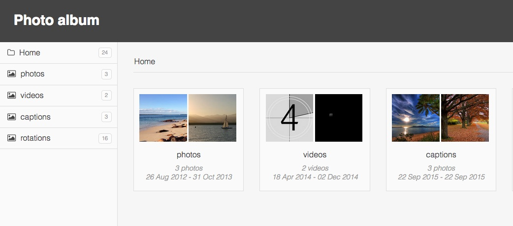

# Themes

Here are the themes available for Thumbsup.
Please submit a pull-request to submit new themes.

Themes can be configured/tweaked by overriding [LESS](http://lesscss.org/) variables,
using the `--css` option.

```bash
thumbsup --theme default --css custom.less
```

```less
@text-color: #cef9b6;
```

## Default



Configuration variables

| Variable    | Description |
|-------------|-------------|
| @body-background | Page background color |
| @header-background | Header background color |
| @header-foreground | Header title color |
| @nav-background | Sidebar navigation background color |
| @nav-highlight | Sidebar hover effect color |
| @album-background | Album cover background color |
| @text-color | Main text color |
| @text-light | Lighter text color |
| @borders | General border color |
| @mobile-trigger | Width below which is switches to mobile mode |
